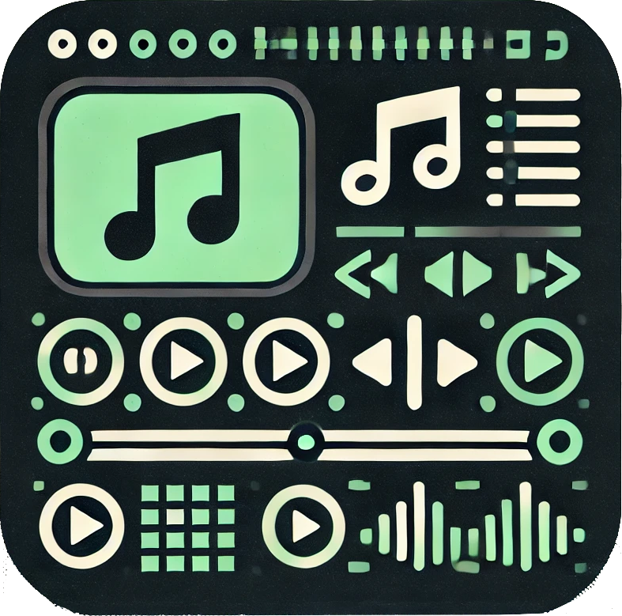

# MusicEFX

A terminal-based MP3 player built with Go. MusicEFX allows users to navigate directories, select MP3 files, search for songs, and play them directly from the terminal. With a simple TUI interface, the app offers playlist management, folder navigation, search functionality, and playback controls.

## Features

- **Main Menu Navigation**: Navigate through different sections such as Auto-Playlist, Playlists, Folder Navigation, and Search.
- **Folder Navigation**: Browse through directories to find MP3 files.
- **Search Functionality**: Search for MP3 files by name.
- **Playlist Management**: Access existing playlists and play MP3 files from them.
- **Playback Control**: Select an MP3 file to play, stop playback, and navigate through options.
- **Auto-Playlist**: Automatically play MP3 files from sorted playlists based on their expiration times.
- **Folder/Directory** Navigation: Navigate nested directories to select and play MP3 files.
  
## Prerequisites

Before building the app, you will need:

- Go 1.21 or higher.

Before running the app, you will need:
- A terminal environment for interacting with the TUI (Text User Interface).

## Usage

### Running the Application

Download the release from GitHub and run the app by specifying a directory path containing MP3 files:

**Linux:**
```bash
./music-efx /path/to/mp3/files
```

**Linux (with download)**
```bash
curl -L https://github.com/SEary342/music-efx/releases/latest/download/MusicEFX -o music-efx && chmod +x music-efx && music-efx

```

**Windows:**
```bat
.\music-efx path\to\mp3\files
```

If no directory is specified, the app will prompt you to input a directory path.

#### Controls

- **Up/Down Arrow Keys:** Navigate through the list of MP3 files.
- **Enter:** Interact with the interface.
- **Esc:** Stop the current playback (if no song is playing, this exits the app).

#### Stopping Playback

To stop the playback of a song, press `Esc`.

## Source Installation

### Clone the Repository

First, clone the repository to your local machine:

```bash
git clone https://github.com/seary342/music-efx.git
cd music-efx
```

### Install Dependencies

Run the following command to install necessary Go dependencies:

```bash
go mod tidy
```

### Build the Application

To build the application, use the following command:

```bash
make build-all
```

This will create the executable `music-efx`.

## License

This project is open source and available under the MIT License.

